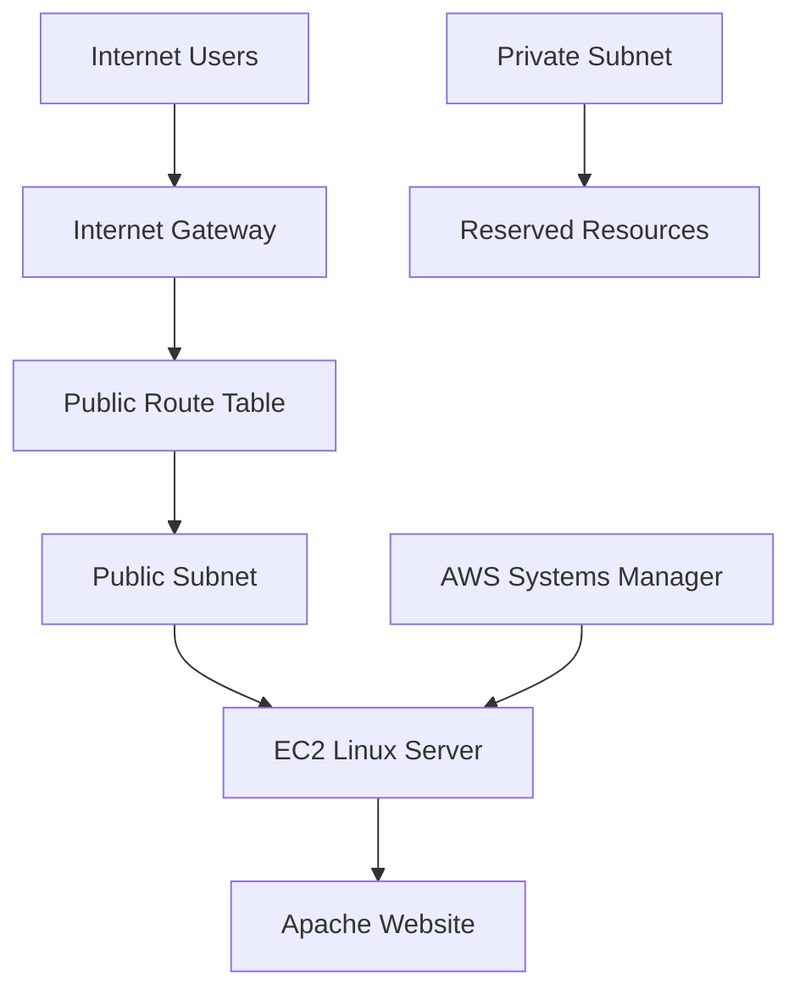

```mermaid
flowchart TD
    A[Internet Users] --> B[Internet Gateway]
    B --> C[Public Route Table]
    C --> D[Public Subnet]
    D --> E[EC2 Linux Server]
    E --> F[Apache Website]
    G[Private Subnet] --> H[Reserved Resources]
    I[AWS Systems Manager] --> E
```
